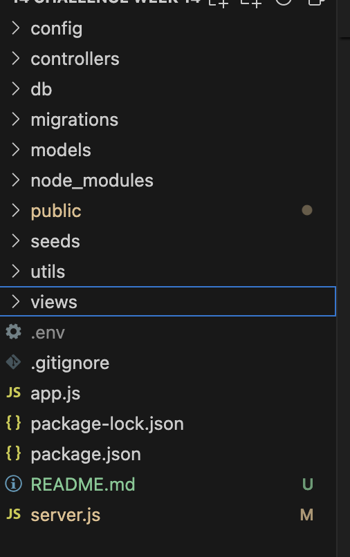
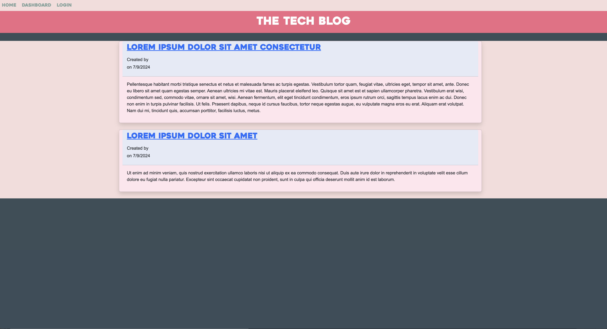
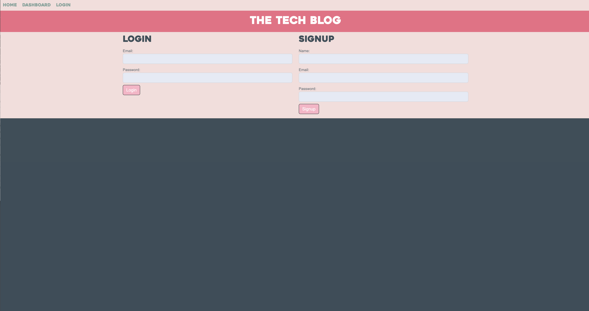
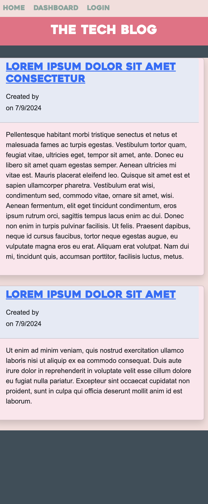

# **Model-View-Controller (MVC) Challenge: Tech Blog**

The purpose of this project was to create a CMS-style blog site like Wordpress, where developers can publish their blogs and comment on posts as well.

We were to follow the MVC paradigm in structure, with Handlebars.js as the template language, Sequelize as the ORM, and express-session npm package for authentication.

I began by doing research and finding sources -- these videos were equally helpful in various parts of the assignment.

# User Story
AS A developer who writes about tech
I WANT a CMS-style blog site
SO THAT I can publish articles, blog posts, and my thoughts and opinions

I began by doing research -- here are some of my sources for this assignment. Sources: https://www.youtube.com/watch?v=m9OSBJaQTlM&ab_channel=PortEXE, https://www.codingnepalweb.com/weather-app-project-html-javascript/, https://home.openweathermap.org/, https://www.youtube.com/watch?v=MIYQR-Ybrn4&ab_channel=GreatStack

I began by making a skeleton file system and putting that in place, as seen here.

I began by making a skeleton file system and putting that in place, as seen here.

Here is the updated site with blog posts visible.

The page is also responsive and works well on a mobile device.

In conclusion, I created a CMS-style blog site that functions by:
- When visiting for the first time, you are presented with the homepage, which includes existing blog posts, navigation links for the homepage and dashboard, and option to log in
- When you click on the homepage, you're taken there
- When you click on other links in the navigation, you're prompted to sign up or sign in
- When you choose to sign up, you're prompted with a username and password
- When you click on the sign-up button, then my credentials are saved and you're logged in to the site
- When you revisit the site at a later time and choose to sign in, you can enter your username and password
- You can then click on an existing blog post, where you're presented with the post titel, contents, post creators username, and date created
- You can enter a comment and click on the submit button while signed in
- The comment is then saved and the post is updated accordingly to display the comment, comment creator's username, and the date created
- When you click on the dashboard option in navigation, you're then taken to the dashboard and can see any blog posts you've created already and an option to add a new blog post
- You're prompted to add a new blog post, enter a title and contents, and then create it
- The title and contents are saved, and you're taken back to an updated dashboard with the new post
- You can see existing posts on the dashboard

I had significant trouble getting this assignment running, and it still isn't fully functional. It's deployed on Render here: https://model-view-controller-j8bt.onrender.com but doesn't load. I had trouble getting the login and signup information saved correctly.

Please follow this link to my github here: https://github.com/szolton/Model-View-Controller.